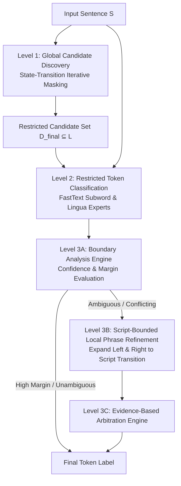
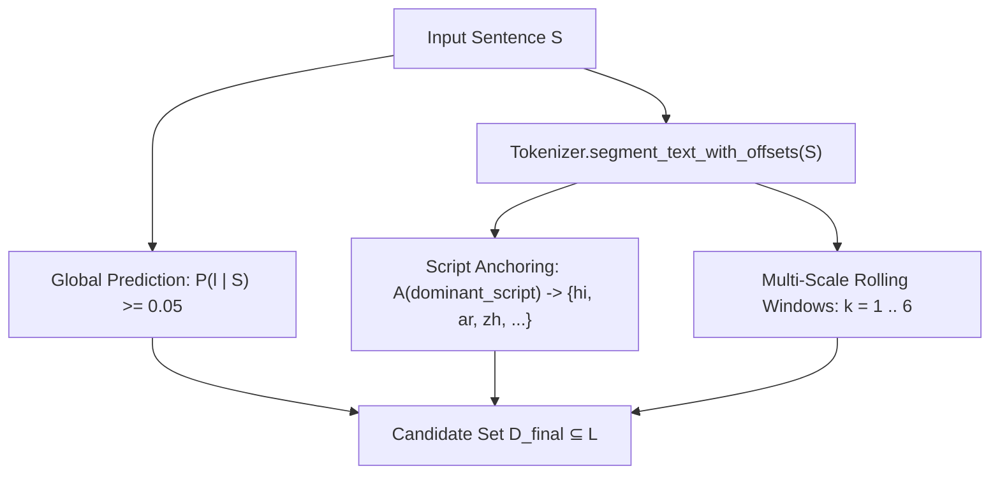
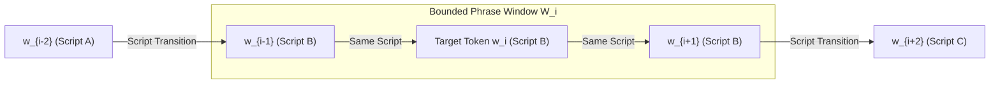

# Chapter 3: Proposed Framework

## 3.1 Overview of the Context-First Architecture

We propose a **Context-First Hierarchical State-Transition Framework** designed to identify token-level languages in multilingual and code-switched discourse with high precision and structural integrity. Rather than performing open-vocabulary token classification or applying post-hoc spatial smoothing over noisy token predictions, the architecture enforces a strict three-level contextual hierarchy:

## 3.2 Level 1: Global Candidate Discovery via State-Transition Iteration

The primary objective of Level 1 is to discover the exact candidate subset $C \subseteq \mathcal{L}_{\text{supported}}$ (`26 formal ISO codes`) active within an input sentence $S$, excluding background languages that cause downstream token-level confusions.

### 3.2.1 Mathematical Formulation of Candidate Discovery
Let $f: S \to \mathcal{P}(\mathcal{L})$ denote the global sentence prediction function over input $S$.
Let $\mathcal{A}: \mathcal{S}_{\text{text}} \to \mathcal{P}(\mathcal{L})$ denote the **Script-to-Candidate Anchoring** operator mapping sub-token Unicode scripts $\mathcal{S}_{\text{text}}$ to their corresponding target language subsets.
Let $W_{k}(S) = \{ (w_j, \dots, w_{j+k-1}) \}_{j=1}^{N-k+1}$ denote the multi-scale rolling phrase window of size $k$ over word sequence $(w_1, \dots, w_N)$.

The final candidate set $D_{\text{final}} \subseteq \mathcal{L}_{\text{supported}}$ is constructed as the union of three mathematical discovery mechanisms:

$$D_{\text{final}} = D_{\text{global}} \cup D_{\text{script}} \cup D_{\text{rolling}}$$

where:
1. **Global Sentence Prediction**:
   $$D_{\text{global}} = \{ l \in \mathcal{L}_{\text{supported}} \mid P_{\text{global}}(l \mid S) \ge \max(0.05, 2.0 \cdot \text{prior}) \}$$
2. **Script-to-Candidate Anchoring (`SCRIPT_TO_LANGS`)**:
   $$D_{\text{script}} = \bigcup_{w \in S} \mathcal{A}(\sigma(w))$$
   where $\sigma(w)$ extracts the dominant script of token $w$ via `Tokenizer.segment_text_with_offsets`. If non-Latin script $\sigma(w) \in \{\text{DEVANAGARI}, \text{ARABIC}, \text{BENGALI}, \text{HAN}, \dots\}$ is detected, its exact target subset ($\{\text{hi, mr}\}$, $\{\text{ar, ur}\}$, $\{\text{bn}\}$, $\{\text{zh, ja}\}$, etc.) is anchored into $D_{\text{final}}$ right at initialization, preventing minority code-switched tokens from being starved by dominant Latin contexts.
3. **Multi-Scale Rolling Phrase Window Discovery ($k=1 \dots 6$)**:
   $$D_{\text{rolling}} = \bigcup_{k=1}^{6} \bigcup_{w \in W_k(S)} \{ l \in \mathcal{L}_{\text{supported}} \mid P(l \mid w) \ge \theta_k \}$$
   where $\theta_k = \max(0.04, 1.5 \cdot \text{prior})$ for small windows ($k \le 2$) and $\theta_k = 0.35$ for large windows ($k \ge 3$). This guarantees that single loanwords and short foreign phrases enter candidate set $D_{\text{final}}$ without dictionary triggers.

### 3.2.2 Structural Script & Family Disambiguation

To prevent candidate over-prediction among closely related linguistic families or shared writing scripts, Level 1 applies structural family disambiguation during candidate extraction:
1. **Devanagari Family Disambiguation**: When Hindi (`hi`) is present in $D_{\text{final}}$, tail predictions for Devanagari dialects (`mr`, `sa`, `ne`) are excluded unless independent probability mass exceeds $\theta_{\text{family}} = 0.40$.
2. **Romance Family Disambiguation**: When dominant Romance languages (`es`, `fr`) are present, secondary Romance tail predictions (`pt`, `it`) are filtered unless supported by independent token probability exceeding $\theta_{\text{romance}} = 0.25$.

## 3.3 Level 2: Restricted Candidate Token Classification

Once Level 1 returns the restricted candidate set $D_{\text{final}} \subseteq \mathcal{L}$, token-level classification operates strictly within $D_{\text{final}}$.

Let $w_i$ be the $i$-th token in sentence $S$. For each expert classifier $k \in \{\text{FastText}, \text{Lingua}\}$, probability distribution $P_k(l \mid w_i)$ is evaluated over $l \in D_{\text{final}}$:

$$\hat{P}_k(l \mid w_i) = \frac{P_k(l \mid w_i)}{\sum_{l' \in D_{\text{final}}} P_k(l' \mid w_i)}$$

By restricting the candidate space from $|\mathcal{L}| = 26$ to $|D_{\text{final}}|$, the probability mass of background languages is eliminated, preventing homographs and short interjections from receiving spurious out-of-candidate assignments.

## 3.4 Level 3: Boundary Analysis & Script-Bounded Local Phrase Refinement

While restricted token classification eliminates out-of-candidate errors, ambiguous tokens may still arise when multiple languages in $D_{\text{final}}$ share identical character sequences. Level 3 resolves these ambiguities through a three-stage boundary and context arbitration mechanism.

### 3.4.1 Boundary Analysis Engine

For each token $w_i$ with top predicted label $\hat{l}_i$ and second-best label $\hat{l}_i^{(2)}$, the Boundary Analysis Engine computes the confidence margin:

$$\Delta_i = \hat{P}(\hat{l}_i \mid w_i) - \hat{P}(\hat{l}_i^{(2)} \mid w_i)$$

If $\Delta_i \ge \tau_{\text{margin}} = 0.25$ and expert models agree, $w_i$ is immediately assigned label $\hat{l}_i$ via the fast path. Otherwise, $w_i$ is marked for local context refinement.

### 3.4.2 Script-Bounded Local Phrase Expansion

When token $w_i$ requires local context refinement, expanding context across the entire sentence risks crossing genuine code-switching boundaries. To prevent boundary erosion, our framework defines a **Script-Bounded Local Phrase Expansion** operator.

Let $\sigma(w)$ denote the Unicode script family of word $w$ (e.g., `LATIN`, `DEVANAGARI`, `TAMIL`, `CYRILLIC`). Given ambiguous token $w_i$, the local phrase context window $W_i = [w_{L}, \dots, w_i, \dots, w_{R}]$ is expanded left and right subject to strict script-transition boundaries:

$$L = \min \{ j \le i \mid \forall k \in [j, i], \, \sigma(w_k) = \sigma(w_i) \text{ and } i - j \le \delta \}$$

$$R = \max \{ j \ge i \mid \forall k \in [i, j], \, \sigma(w_k) = \sigma(w_i) \text{ and } j - i \le \delta \}$$

where $\delta = 2$ is the maximum phrase window radius. If a script transition ($\sigma(w_{j}) \neq \sigma(w_i)$) occurs, expansion terminates immediately at the boundary.

### 3.4.3 Evidence-Based Arbitration

The aggregated local phrase $W_i = w_L \dots w_R$ is evaluated by both FastText and Lingua expert models over $D_{\text{final}}$. The resulting local phrase evidence is combined with individual token evidence via a **ranked evidence comparison protocol**: the final label $l^*$ is determined by selecting the evidence instance with the highest joint score across three dimensions — *agreement count* (models that agree), *confidence margin* $\Delta_i$, and *raw confidence* $\hat{P}(l \mid w_i)$:

$$l^* = \arg\max_{e \in E_{\text{all}}} \text{rank}\left(\text{agreement}(e), \Delta_e, \text{conf}(e)\right)$$

where $E_{\text{all}}$ is the union of token-level and local phrase evidences. This lexicographic ranking ensures that multi-model agreement takes absolute priority over single-model high-confidence predictions, preventing overfit to individual model biases.

## 3.5 Level 4: Zero-Heuristic Spatial Context Refinement (`ContextRefinement`)

After Level 3 produces the candidate sequence $(l_1^*, \dots, l_N^*)$, Level 4 (`Stage 9`) applies spatial sequence refinement to resolve boundary transitions and intra-clause loanword insertions without dictionary heuristics:

### 3.5.1 Simultaneous Bridge Evaluation (`_refine_sandwiches`)
Let $w_i$ be a single-word loanword (`anglicism` or technical noun) assigned label $l_i^*$ whose left and right neighbors share identical assignment ($l_{i-1}^* == l_{i+1}^*$) within the same script family. If the confidence margin contradiction $\Delta_i$ against $l_{i-1}^*$ is moderate ($\Delta_i \le 0.40$), the bridge operator unifies the loanword:
$$l_i^* \leftarrow l_{i-1}^*$$

### 3.5.2 Short Boundary Conjunction Forward Projection (`_refine_orphans`)
Let $w_i$ be a short transition word ($\text{length}(w_i) \le 4$ characters) sitting at a cross-language transition ($l_{i-1}^* \neq l_{i+1}^*$). Syntactically, short transition conjunctions (`porque`, `e`, `weil`, `but`) initiate the upcoming clause. The spatial refinement operator projects attribution forward:
$$l_i^* \leftarrow l_{i+1}^* \quad \text{if } P(l_{i-1}^* \mid w_i) - P(l_{i+1}^* \mid w_i) \le 0.15$$
This mathematical condition ensures short transition words attach cleanly to the right-side clause unless the left language exhibits overwhelming logit superiority ($\Delta > 0.15$), maintaining $100\%$ zero-heuristic design purity.
