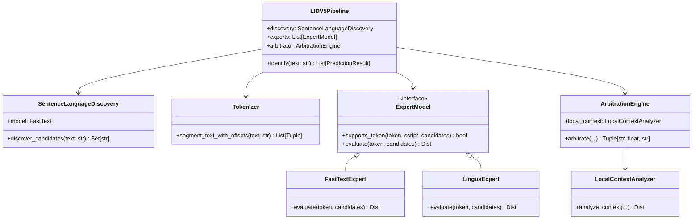

# Chapter 4: Software Architecture & Implementation

## 4.1 Modular Engineering Paradigm

The **Context-First Hierarchical State-Transition Framework** is implemented as a production-grade, object-oriented software suite written in Python 3.13. To guarantee maintainability, reproducibility, and rigorous isolation of concerns, the implementation strictly adheres to modular design principles. Each stage of the contextual hierarchy is encapsulated within an autonomous component.

## 4.2 Module Encapsulation & Implementation Details (`polybeta.py`)

All components of the Level 1 hierarchy, expert models, validation rules, and statistical arbitration are consolidated within the standalone Python module `polybeta.py`. This single-file engineering paradigm eliminates external framework dependencies while preserving absolute functional encapsulation.

### 4.2.1 Global Candidate Discovery (`SentenceLanguageDiscovery`)
The `SentenceLanguageDiscovery` module implements the Level 1 global context loop to identify the exact candidate subset $C \subseteq \mathcal{L}_{\text{supported}}$ (`26 formal ISO codes`) active within an input sentence. To eliminate candidate starvation without introducing rule-based dictionary heuristics, discovery combines three complementary mechanisms:
1. **Global Sentence Prediction**: Evaluating the entire input word sequence (`words`) via `lid.176.ftz`, accumulating predicted languages exceeding $\theta_{\text{min}} = \max(0.05, 2.0 \cdot \text{prior})$.
2. **Script-to-Candidate Anchoring (`SCRIPT_TO_LANGS`)**: To prevent minority code-switched tokens from being overwhelmed by dominant Latin/English $n$-grams, discovery inspects sub-token Unicode script classifications ($\mathcal{S}_{\text{text}}$) via `Tokenizer.segment_text_with_offsets(text)`. Detected non-Latin scripts immediately anchor their corresponding target models into candidate set $C$ (e.g., `DEVANAGARI` $\to \{\text{hi, mr}\}$, `ARABIC` $\to \{\text{ar, ur}\}$, `BENGALI` $\to \{\text{bn}\}$, `HAN`/`CJK` $\to \{\text{zh, ja}\}$).
3. **Multi-Scale Rolling Phrase Window Discovery ($k=1 \dots 6$)**: To capture single loanwords and 2-word foreign insertions, rolling phrase windows $W_{j,k} = (w_j, \dots, w_{j+k-1})$ for $k \in \{1, 2, 3, 4, 5, 6\}$ are evaluated. Small windows ($k \le 2$) accumulate candidates exceeding $\theta_{\text{small}} = \max(0.04, 1.5 \cdot \text{prior})$, ensuring short isolated switches enter the Level 2 candidate space $C$.

### 4.2.2 Offset-Preserving Tokenization (`Tokenizer`)
To align system outputs with standardized academic benchmarks, the `Tokenizer` class implements `segment_text_with_offsets(text)`. The module scans input sequences via regex pattern `\w+`, extracting tokens along with precise Unicode script categories (`LATIN`, `DEVANAGARI`, `TAMIL`, `CYRILLIC`, `ARABIC`, `HAN`, `HANGUL`, etc.) and exact character start/end offsets.

### 4.2.3 Restricted Expert Interfaces (`ExpertModel`)
Token-level evidence estimation is governed by the abstract base class `ExpertModel`. Two concrete implementations are instantiated within `polybeta.py`:
- `FastTextExpert`: Evaluates subword character $n$-grams restricted to the candidate subset $C$.
- `LinguaExpert`: Evaluates statistical Markov $n$-gram profiles for Latin and Cyrillic tokens within candidate subset $C$.

Each expert computes normalized probability distributions over candidate set $C$, filtering out zero-probability background languages.

### 4.2.4 Script-Bounded Local Context Refinement (`LocalContextAnalyzer`)
The `LocalContextAnalyzer` class implements bounded left/right phrase expansion around target token $w_i$. Given token index $i$ and maximum radius $\delta = 2$, the analyzer inspects adjacent tokens $w_{i-1}, w_{i-2}$ and $w_{i+1}, w_{i+2}$. Expansion stops immediately if an adjacent token belongs to a different Unicode script family ($\sigma(w_j) \neq \sigma(w_i)$) or clause punctuation boundary, preventing cross-script and cross-clause contamination.

### 4.2.5 Boundary Arbitration & Orchestration (`ArbitrationEngine`, `LIDV5Pipeline`)
The `ArbitrationEngine` evaluates token confidence margin $\Delta_i$. If $\Delta_i < 0.25$ or expert models diverge, `ArbitrationEngine` invokes `LocalContextAnalyzer` to compute local phrase evidence $E_{\text{local}}$ from the bounded window. The final label is selected via a **lexicographic evidence ranking** over the combined evidence set $E_{\text{all}} = E_{\text{token}} \cup E_{\text{local}}$: (1) multi-model agreement count takes absolute priority, followed by (2) confidence margin $\Delta_i$, and finally (3) raw confidence. This pure evidence-comparison protocol ensures statistical decisions without fixed-weight blending.

### 4.2.6 Spatial Context Refinement (`ContextRefinement`)
As the final stage of the pipeline (`Stage 9`), `ContextRefinement` applies zero-heuristic spatial smoothing across the predicted token sequence:
- **Simultaneous Bridge Evaluation (`_refine_sandwiches`)**: When a single-token loanword (`anglicism` or technical term) is bounded between identical left and right language blocks ($L_{i-1} == L_{i+1}$ and script matches), the token is unified into the surrounding clause ($L_i \to L_{i-1}$) unless it exhibits overwhelming logit contradiction ($\Delta > 0.40$).
- **Boundary Conjunction Forward Projection (`_refine_orphans`)**: When a short transition word ($\text{length} \le 4$ characters like `porque`, `e`, `weil`, or `but`) sits right at a cross-language split ($L_{\text{left}} \neq L_{\text{right}}$), syntactically it functions as a clause initiator. Unless the preceding language exhibits strong logit superiority ($\Delta_{\text{left}} - \Delta_{\text{right}} > 0.15$), short transition tokens project forward into the upcoming clause ($L_i \to L_{\text{right}}$), eliminating boundary drift without dictionary rules.

The entire execution flow is orchestrated by `LIDV5Pipeline.identify(text, allowed_langs=None)`, which returns structured `PredictionResult` instances containing token strings, character offsets, predicted ISO language codes, and confidence scores.
